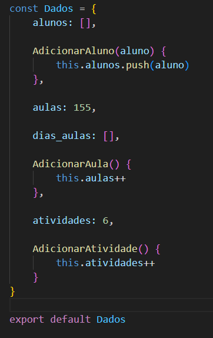
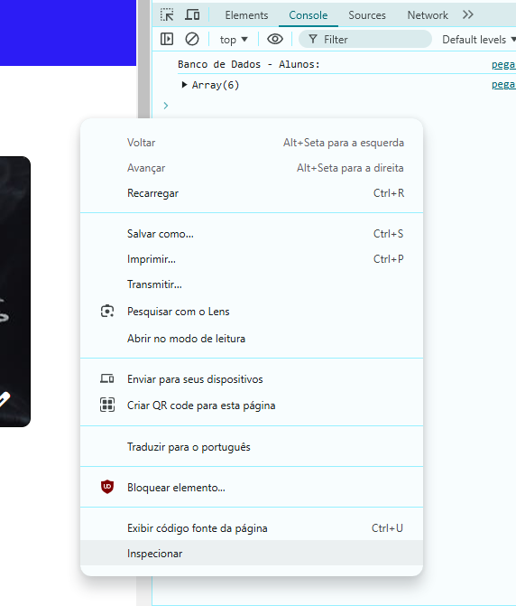
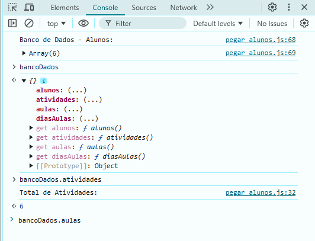
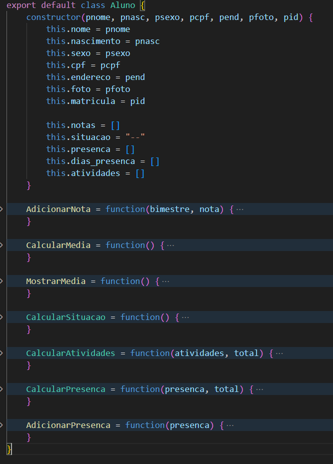
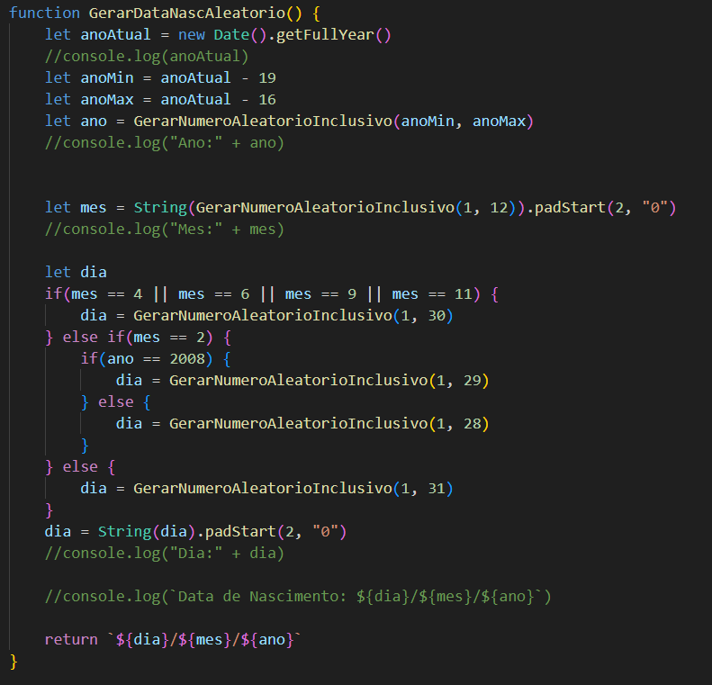
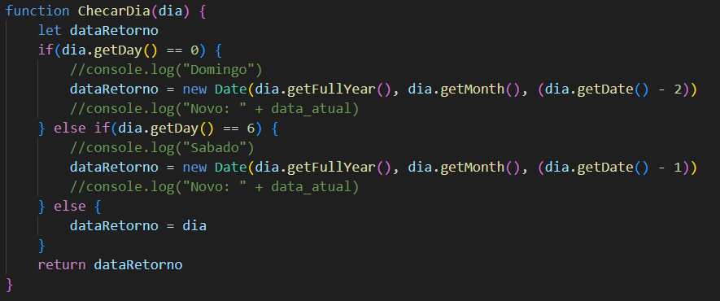
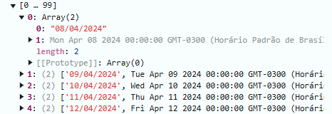

[JAVASCRIPT__BADGE]: https://img.shields.io/badge/Javascript-000?style=for-the-badge&logo=javascript
[HTML__BADGE]: https://img.shields.io/badge/html5-%23E34F26.svg?style=for-the-badge&logo=html5&logoColor=white 
[CSS__BADGE]: https://img.shields.io/badge/css3-%231572B6.svg?style=for-the-badge&logo=css3&logoColor=white
[BOOTSTRAP__BADGE]: https://img.shields.io/badge/bootstrap-%238511FA.svg?style=for-the-badge&logo=bootstrap&logoColor=white 
[MIT__BADGE]: https://img.shields.io/github/license/Naereen/StrapDown.js.svg

<h1 align="center" style="font-weight: bold;">🎓 My Class</h1>

![html][HTML__BADGE]
![css3][CSS__BADGE]
![javascript][JAVASCRIPT__BADGE]
![bootstrap][BOOTSTRAP__BADGE]
![mit][MIT__BADGE]

  <a href="#sobre">Sobre</a> • 
  <a href="#acesso">Acesse Aqui</a> • 
  <a href="#funcionalidades">Funcionalidades</a> • 
  <a href="#licenca">Licença</a> •

 

    

 

<h2 id="sobre">📌 Sobre</h2>
Um sistema escolar onde é possível adicionar alunos, lançar notas, lançar presença, entre outras coisas. Projeto realizado com <strong>HTML</strong>, <strong>CSS</strong>, <strong>Javascript</strong> e  <strong>Bootstrap</strong>, com o objetivo de colocar em prática o que estudei, principalmente em <ins>Javascript</ins>.
 
 

<h2 id="acesso">🚀 Acesse o Projeto</h2>
Veja o projeto você mesmo: https://joaovitordomingos.github.io/My-Class/
 
 

<h2 id="funcionalidades">💻 Funcionalidades</h2>

Nesta sessão falarei o que o projeto faz e deixarei explícito quais conhecimentos, principalmente de Javascript, coloquei em prática.

  
<h3>Sumário</h3>

  <ol>
    <li><a href="#banco">Simulação de um Banco de Dados</a></li>
    <li><a href="#modulo">Script tipo Módulo</a></li>
    <li><a href="#api">Pegando os Alunos de uma API</a></li>
    <li><a href="#aulas">Criando os dias que teve aulas</a></li>
    <li><a href="#modal_dinamico">Modal Dinâmico</a></li>
    <li><a href="#verificacao">Verificacões dos Formulários</a></li>
    <li><a href="#impressao">Impressões</a></li>
    <li><a href="#conhecimentos">Conhecimentos Aplicados</a></li>
  </ol>

<h3 id="banco">Simulação de um Banco de Dados</h3>

Neste projeto, todas as informações referentes as notas dos alunos, as quantidades de aulas, dias que teve aulas e outras coisas são guardadas em uma simulação de banco de dados.

Este banco de dados é um script do tipo modulo, onde nele há um objeto literal, como este tipo de objeto não é independente não importa quantas instâncias há, é perfeito para uma simulação.

Este "Banco de Dados" guarda os alunos, que será um objeto padrão, guarda a quantidade total de aulas e atividades e também guarda os dias em que teve aulas.

Toda alteração que tiver, como adicionar um aluno novo, lançar presença, etc..., o Banco de Dados será atualizado, mas como é uma simulação, ao resetar a página, as informações também serão resetadas.

É possível acompanhar o banco de dados pelo inspetor do navegador, pois este objeto está armazenado em uma variável global.

Para acompanhar o Banco de Dados:

<ol>
  <li>Ative o Console do Navegador pressionando CTRL+SHIFT+I ou, também, em qualquer parte da página, clique direito do mouse, inspecionar, console.</li>
  <li>De início já terá o Banco de Dados dos Alunos, mas para ver o Banco de Dados completo digite no console: <strong>bancoDados</strong></li>
  <li>Caso queira acessar algo em específico do Banco de Dados, digite: <strong>bancoDados.alunos</strong>, <strong>bancoDados.aulas</strong>, <strong>bancoDados.diasAulas</strong>, <strong>bancoDados.atividades</strong>.</li>
</ol>

  
  

 
 

<h3 id="modulo">Script tipo Módulo</h3>

Foi criado um script do tipo módulo chamado <i>metodos</i> onde ficará métodos que serão utilizados em várias partes do site, por exemplo um método que gera um número aleatório.

 
 

<h3 id="api">Pegando os Alunos de uma API</h3>

Os alunos e suas informações são feitos na hora que carrega a página. Utilizei a API do site <a href="https://reqres.in/">Reqres</a> para fazer os alunos.

Utilizando uma <strong>async function</strong> e <strong>fetch</strong>, acesso esta API e pego os alunos, porém so irei utilizar desta API o nome, sobrenome, foto e id. As outras informações dos alunos foram criadas.

Todas as informações dos alunos é armazenadas em um objeto do tipo padrão, que está num script separado do tipo módulo.

<h5>Data de Nascimento:</h5>

Os alunos terão idades de 16 a 19, para isso, com o metodo <strong>Date().getFullYear()</strong>, pego o ano atual e subtraio da idade mínima e máxima, guardando os dois valores para assim gerar anos aleátorios de nascimento. Agora o mês simplesmente utilizo a função de gerar números aleátórios. E para o dia, é realizado a mesma coisa, mas com uma verificação antes, já que fevereiro tem apenas 29 dias e os meses abril, junho, setembro e novembro tem 30 dias.

<h5>Sexo, Endereço, Nota e CPF:</h5>

Para o sexo e endereço, apenas realizado uma condição, comparando o id, por exemplo o id 12 é uma menina, e seu endereço é "Rua do MasterX". Agora para o cpf, apenas gero números aleatórios de 0 a 9. As notas também são geradas aleatóriamentes, de 0 a 10.

<h5>Presença:</h5>

Agora a presença do aluno, é escolhido aleatóriamente o número 0 ou 1(0 - falta, 1 - presença), para definir se o aluno veio ou não, isso se repete pela quantidade total de aulas. Este dado é armazenado no array de <strong>dias_presenca</strong> do objeto aluno, onde cada posição equivale a um dia de aula, sendo a primeira posição o primeiro dia de aula.

<h5>Foto:</h5>

A foto do aluno é um link para uma imagem, então este link é guarda no objeto aluno e quando for mostrado se usa a propriedade <strong>background-image</strong> do CSS.

<h5>Observação:</h5>

Note que alguns dados são gerados aleatóriamente no momento que se carrega a página, então cada vez que recarrega a página, estes dados são perdidos e informações diferentes são geradas.

 
 

<h3 id="aulas">Criando os dias que teve aulas</h3>

Após a criação dos alunos, é criado os dias em que teve aulas, para isso, se obtém o dia atual do usário, e a partir deste dia para trás é criado os dias que teve aula até atingir o máximo de aulas.

Porém, o final de semana não é considerado dias de aulas, então foi criado uma função que checa se o dia é um domingo ou sábado, se for, é pego o dia anterior até ser um dia de semana. Dias em que teve feriado não foi considerado.

Então quando é pego o dia atual do usuário, é chamado a função para checar o dia, para que a contagem das aulas comece em um dia da semana, a partir disto é subtraido um dia e checado para que este dia seja um dia da semana, isso se repete até o dar o máximo de aulas.

Observe que o dia que é pego do usuário será o último dia de aula. Estes dias de aulas são guardados no array <strong>dias_aulas</strong> em formato de array, onde a primeira posição é a data no formato "dd/mm/aaaa" e a segunda posição o objeto date.

 
 

<h3 id="modal_dinamico">Modal Dinâmico</h3>

 
 

<h2 id="licenca">📃 Licença</h2>
Veja a lincença do projeto: <a href="https://github.com/JoaoVitorDomingos/My-Class/tree/main?tab=MIT-1-ov-file">MIT License</a>
 
 
