[JAVASCRIPT__BADGE]: https://img.shields.io/badge/Javascript-000?style=for-the-badge&logo=javascript
[HTML__BADGE]: https://img.shields.io/badge/html5-%23E34F26.svg?style=for-the-badge&logo=html5&logoColor=white 
[CSS__BADGE]: https://img.shields.io/badge/css3-%231572B6.svg?style=for-the-badge&logo=css3&logoColor=white
[BOOTSTRAP__BADGE]: https://img.shields.io/badge/bootstrap-%238511FA.svg?style=for-the-badge&logo=bootstrap&logoColor=white 
[MIT__BADGE]: https://img.shields.io/github/license/Naereen/StrapDown.js.svg

<h1 align="center" style="font-weight: bold;">🎓 My Class</h1>

![html][HTML__BADGE]
![css3][CSS__BADGE]
![javascript][JAVASCRIPT__BADGE]
![bootstrap][BOOTSTRAP__BADGE]
![mit][MIT__BADGE]

  <a href="#sobre">Sobre</a> • 
  <a href="#acesso">Acesse Aqui</a> • 
  <a href="#funcionalidades">Funcionalidades</a> • 
  <a href="#licenca">Licença</a> •

 

    

 

<h2 id="sobre">📌 Sobre</h2>
Um sistema escolar onde é possível adicionar alunos, lançar notas, lançar presença, entre outras coisas. Projeto realizado com <strong>HTML</strong>, <strong>CSS</strong>, <strong>Javascript</strong> e  <strong>Bootstrap</strong>, com o objetivo de colocar em prática o que estudei, principalmente em <ins>Javascript</ins>.
 
 

<h2 id="acesso">🚀 Acesse o Projeto</h2>
Veja o projeto você mesmo: https://joaovitordomingos.github.io/My-Class/
 
 

<h2 id="funcionalidades">💻 Funcionalidades</h2>

Nesta sessão falarei o que o projeto faz e deixarei explícito quais conhecimentos, principalmente de Javascript, coloquei em prática.

  
<h3>Sumário</h3>

  <ol>
    <li><a href="#banco">Simulação de um Banco de Dados</a></li>
    <li><a href="#modulo">Script tipo Módulo</a></li>
    <li><a href="#api">Pegando os Alunos de uma API</a></li>
    <li><a href="#aulas">Criando os dias que teve aulas</a></li>
    <li><a href="#modal_dinamico">Modal Dinâmico</a></li>
    <li><a href="#verificacao">Verificacões dos Formulários</a></li>
    <li><a href="#impressao">Impressões</a></li>
    <li><a href="#outras">Outras Funcionalidades</a></li>
    <li><a href="#conhecimentos">Conhecimentos Aplicados</a></li>
  </ol>

<h3 id="banco">Simulação de um Banco de Dados</h3>

Neste projeto, todas as informações referentes as notas dos alunos, as quantidades de aulas, dias que teve aulas e outras coisas são guardadas em uma simulação de banco de dados.

Este banco de dados é um script do tipo modulo, onde nele há um objeto literal, como este tipo de objeto não é independente não importa quantas instâncias há, é perfeito para uma simulação.

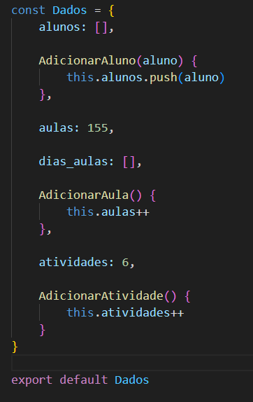

Este "Banco de Dados" guarda os alunos, que será um objeto padrão, guarda a quantidade total de aulas e atividades e também guarda os dias em que teve aulas.

Toda alteração que tiver, como adicionar um aluno novo, lançar presença, etc..., o Banco de Dados será atualizado, mas como é uma simulação, ao resetar a página, as informações também serão resetadas.

É possível acompanhar o banco de dados pelo inspetor do navegador, pois este objeto está armazenado em uma variável global.

Para acompanhar o Banco de Dados:

<ol>
  <li>Ative o Console do Navegador pressionando CTRL+SHIFT+I ou, também, em qualquer parte da página, clique direito do mouse, inspecionar, console.</li>
  <li>De início já terá o Banco de Dados dos Alunos, mas para ver o Banco de Dados completo digite no console: <strong>bancoDados</strong></li>
  <li>Caso queira acessar algo em específico do Banco de Dados, digite: <strong>bancoDados.alunos</strong>, <strong>bancoDados.aulas</strong>, <strong>bancoDados.diasAulas</strong>, <strong>bancoDados.atividades</strong>.</li>
</ol>

  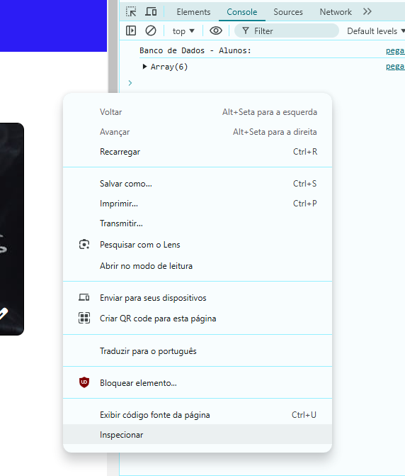
  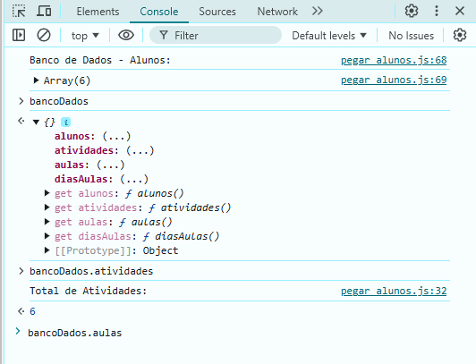

 
 

<h3 id="modulo">Script tipo Módulo</h3>

Foi criado um script do tipo módulo chamado <i>metodos</i> onde ficará métodos que serão utilizados em várias partes do site, por exemplo um método que gera um número aleatório.

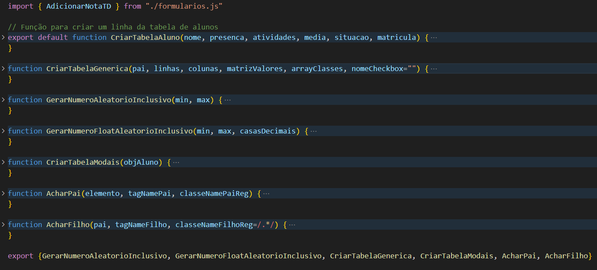

 
 

<h3 id="api">Pegando os Alunos de uma API</h3>

Os alunos e suas informações são feitos na hora que carrega a página. Utilizei a API do site <a href="https://reqres.in/">Reqres</a> para fazer os alunos.

Utilizando uma <strong>async function</strong> e <strong>fetch</strong>, acesso esta API e pego os alunos, porém so irei utilizar desta API o nome, sobrenome, foto e id. As outras informações dos alunos foram criadas.

Todas as informações dos alunos é armazenadas em um objeto do tipo padrão, que está num script separado do tipo módulo.

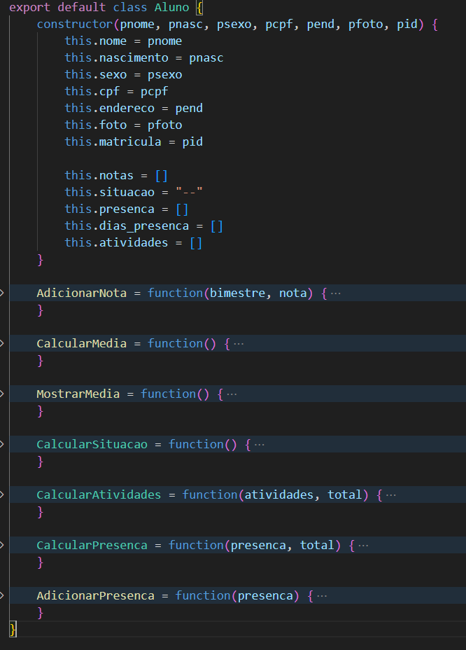

<h4>Data de Nascimento:</h4>

Os alunos terão idades de 16 a 19, para isso, com o metodo <strong>Date().getFullYear()</strong>, pego o ano atual e subtraio da idade mínima e máxima, guardando os dois valores para assim gerar anos aleátorios de nascimento. Agora o mês simplesmente utilizo a função de gerar números aleátórios. E para o dia, é realizado a mesma coisa, mas com uma verificação antes, já que fevereiro tem apenas 29 dias e os meses abril, junho, setembro e novembro tem 30 dias.

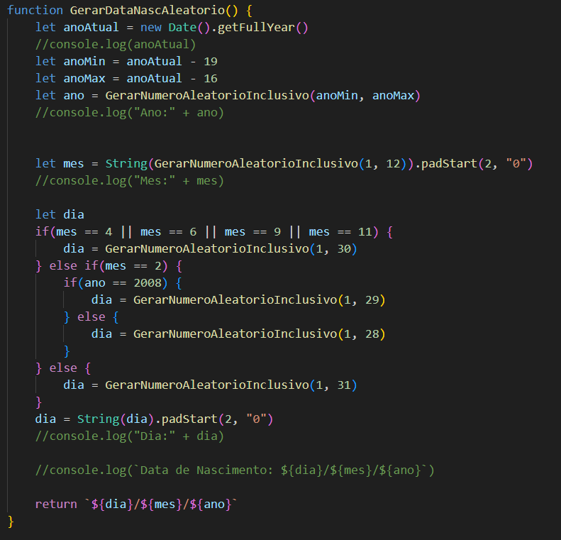

<h4>Sexo, Endereço, Nota e CPF:</h4>

Para o sexo e endereço, apenas realizado uma condição, comparando o id, por exemplo o id 12 é uma menina, e seu endereço é "Rua do MasterX". Agora para o cpf, apenas gero números aleatórios de 0 a 9. As notas também são geradas aleatóriamentes, de 0 a 10.

<h4>Presença:</h4>

Agora a presença do aluno, é escolhido aleatóriamente o número 0 ou 1(0 - falta, 1 - presença), para definir se o aluno veio ou não, isso se repete pela quantidade total de aulas. Este dado é armazenado no array de <strong>dias_presenca</strong> do objeto aluno, onde cada posição equivale a um dia de aula, sendo a primeira posição o primeiro dia de aula.

<h4>Foto:</h4>

A foto do aluno é um link para uma imagem, então este link é guarda no objeto aluno e quando for mostrado se usa a propriedade <strong>background-image</strong> do CSS.

<h4>Tabela Principal:</h4>

Após ter criado um objeto aluno, é feito uma linha de tabela que conterá algumas informações. No script "metodos", o método padrão(default) é o que irá criar esta linha da tabela.

<h4>Observação:</h4>

Note que alguns dados são gerados aleatóriamente no momento que se carrega a página, então cada vez que recarrega a página, estes dados são perdidos e informações diferentes são geradas.

 
 

<h3 id="aulas">Criando os dias que teve aulas</h3>

Após a criação dos alunos, é criado os dias em que teve aulas, para isso, se obtém o dia atual do usário, e a partir deste dia para trás é criado os dias que teve aula até atingir o máximo de aulas.

Porém, o final de semana não é considerado dias de aulas, então foi criado uma função que checa se o dia é um domingo ou sábado, se for, é pego o dia anterior até ser um dia de semana. Dias em que teve feriado não foi considerado.

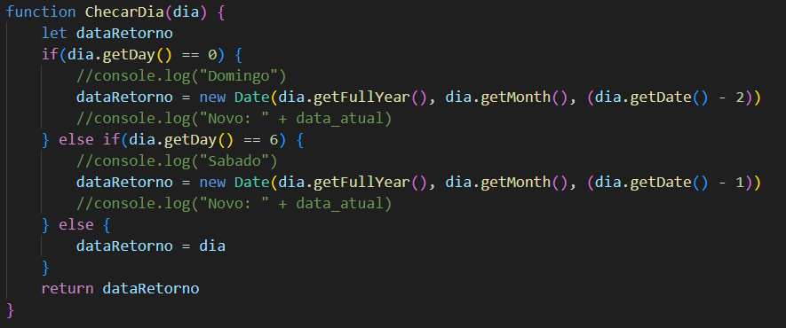

Então quando é pego o dia atual do usuário, é chamado a função para checar o dia, para que a contagem das aulas comece em um dia da semana, a partir disto é subtraido um dia e checado para que este dia seja um dia da semana, isso se repete até o dar o máximo de aulas.

Observe que o dia que é pego do usuário será o último dia de aula. Estes dias de aulas são guardados no array <strong>dias_aulas</strong> em formato de array, onde a primeira posição é a data no formato "dd/mm/aaaa" e a segunda posição o objeto date.

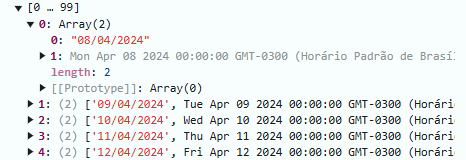

 
 

<h3 id="modal_dinamico">Modal Dinâmico</h3>

O maior exemplo de modal dinâmico é o "Veja Mais" do aluno, foi se utilizado uma estrutura genérica de modal e por meio do Javascript foi se alterando o conteúdo do modal, este é o modal dinâmico do <a href="https://getbootstrap.com/docs/5.3/components/modal/#varying-modal-content">Bootstrap</a>.

  
  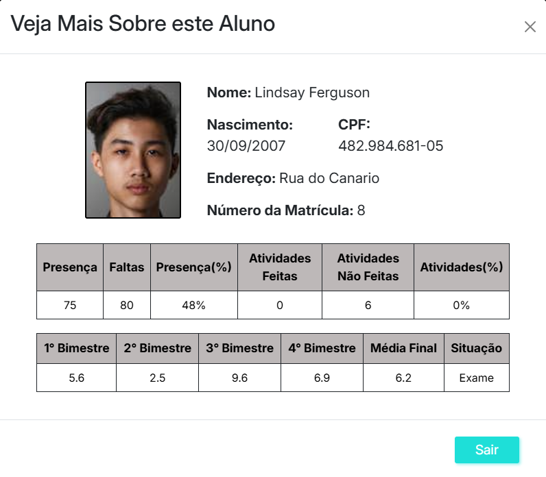

Cada ícone na parte "Veja Mais" tem um <strong>data-bs-whatever</strong> com o valor da matrícula do aluno, isso irá diferenciar os alunos, assim sabendo qual conteúdo mostrar.

Outro exemplo, é o modal de Criar/Editar Sessão/Atividade, ao apertar no botão de criar o modal vem com o título Criar Atividade/Sessão, agora quando se aperta no ícone de edição, o modal vem com o nome Editar Atividade/Sessão

  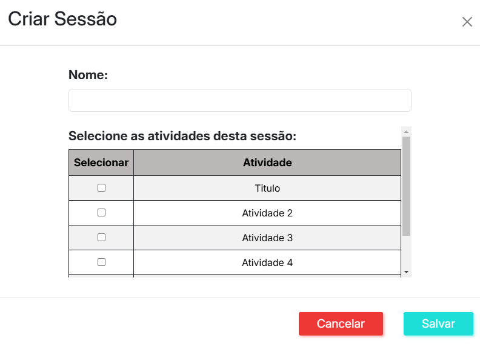
  

No modal de Sessão a tabela também é alterada dinâmicamente, caso se adicione uma atividade nova ou altere o nome de uma atividade, ao abir o modal a tabela muda de acordo com os nomes das atividades.

<h3 id="verificacao">Verificacões dos Formulários</h3>

Os formulários presentes nos modais, como lançar notas, lançar presença, entre outros, tem suas verificações, não é possível salvar sem que tudo esteja preenchido.

  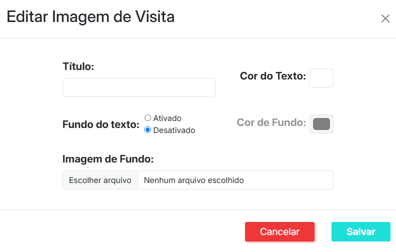
  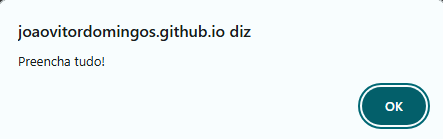

Alguns formulários tem suas verficações em específicas, segue a lista a seguir:

<ul>
  <li><a href="#lancar_notas">Lançar Notas</a></li>
  <li><a href="#lancar_presenca">Lançar Presença</a></li>
  <li><a href="#adicionar_aluno">Adicionar Aluno</a></li>
  <li><a href="#imprimir_presenca">Imprimir Presença</a></li>
</ul>
<h4 id="lancar_notas">Lançar Notas</h4>

Neste formulário, além da verificação de preenchimento, há uma verificação na data e na nota. Não é possível lançar a nota em uma data antes do primeiro dia de aula, em uma data acima de 30 dias e nos finais de semana.

  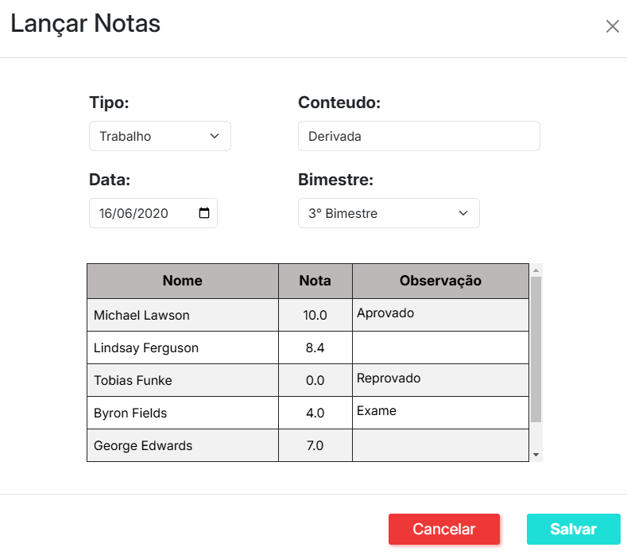
  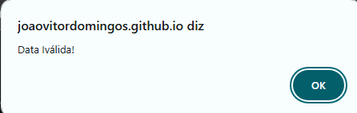

Também não é possível lançar uma nota abaixo de zero e acima de 10.

  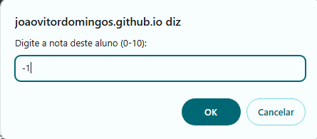
  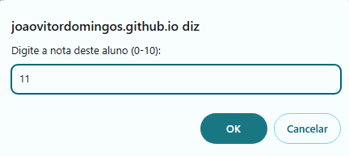
  

<h4 id="lancar_presenca">Lançar Presença</h4>

A mesma verificação de data que ocorre no "Lançar Notas", ocorre no modal "Lançar Presença", sendo assim, não é possível lançar uma presença antes do primeiro dia de aula ou em um dia acima de 30 dias após o último dia de aula e nos finais de semana.

Caso selecione uma data que já exista, a presença dos alunos selecionados neste dia irá alterar, ou seja, caso lance presença num dia já existente, é editado a presença.

Agora caso seja um dia que não exista e está dentro das condições, simplesmente este dia é adicionado no banco de dados e as presenças dos alunos no array "dias_presenca" de seus objetos.

OBS: a posição da presença no array "dias_presenca" de cada objeto aluno equivale ao dia naquela posição do array do banco de dados, ou seja, a presença do aluno na posição 0 equivale ao dia na posição 0 do banco de dados.

<h4 id="adicionar_aluno">Adicionar Aluno</h4>

Como todos os alunos já presentes tem entre 16 a 19 anos, então não é possível adicionar um aluno mais novo que 16 ou mais velho que 19 anos, para isso existe uma verificação em sua data de nascimento.

  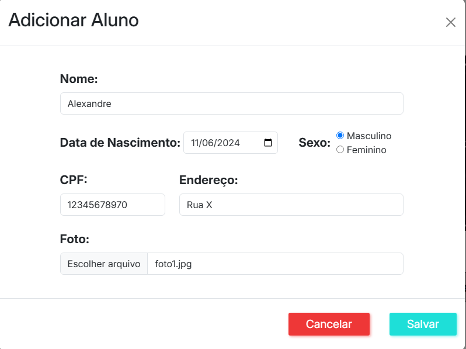
  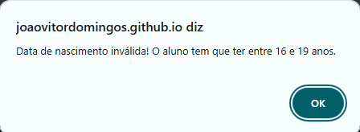

Em seu nome não é possível adicionar números ou caracteres especiais, apenas aqueles utilizados em nomes como: ã,â,...

O CPF tem que seguir como é exemplificado, caso tenha algo de errado, irá acionar o alerta.

  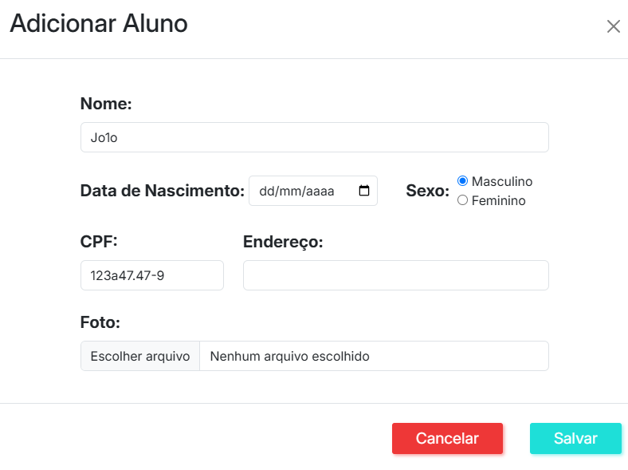
  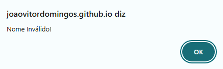
  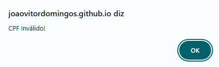

<h4 id="imprimir_presenca">Imprimir Presença</h4>

Neste formulário, não é possível imprimir datas que não existam aulas, a data final não pode ser menor que a data inicial, tem uma máximo de 30 dias que pode ser impresso e um mínimo de 5 dias.

  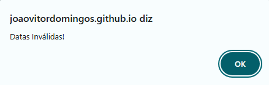
  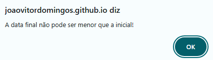
  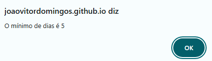
  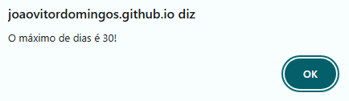

 
 

<h3 id="impressao">Impressões</h3>

É possível imprimir as informações dos alunos. Há 5 tipos de impressões:

<h4>Boletim da sala toda</h4>
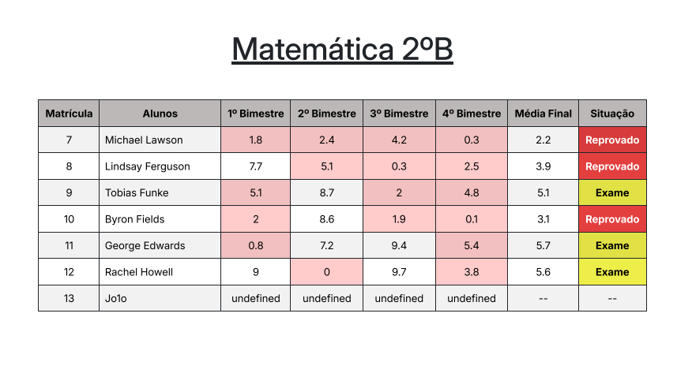
<h4>Boletim de alunos específicos</h4>
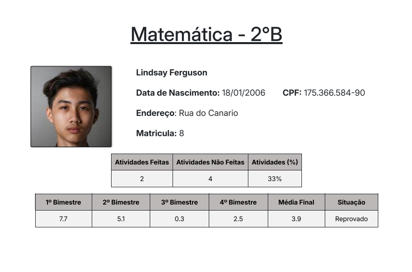
<h4>Presença da sala toda</h4>

<h4>Presença de alunos específicos</h4>
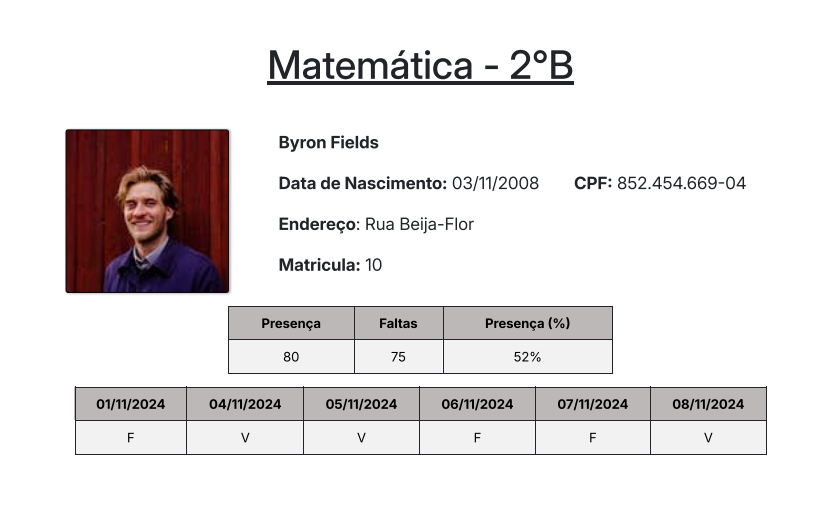
<h4>Tabela principal</h4>
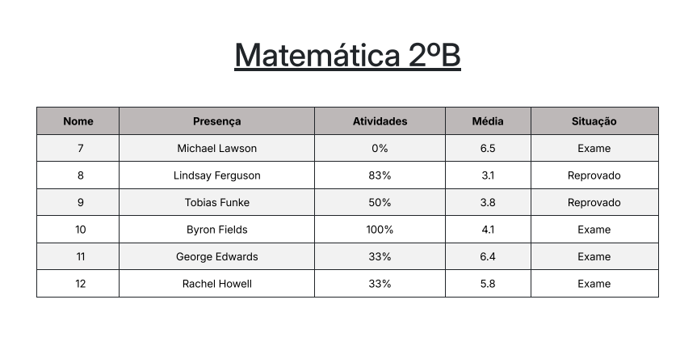

Obs: Para melhor qualidade da impressão, é bom que ative os "gráficos de segundo plano" em "mais definições"

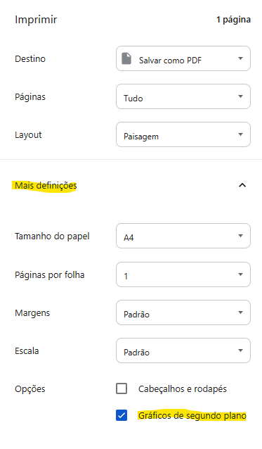

 
 

<h3 id="outras">Outras Funcionalidades</h3>

Além de todas estas funcionalidades apresentadas, há outras também importantes, como a navegação dinâmica que existe, feita com o <a href="https://getbootstrap.com/docs/5.3/components/navs-tabs/#javascript-behavior">Bootstrap</a>.

Os botões de "Cancelar" dos modais resetam todas informações adicionadas neles e os fecham, enquanto o icone de "X" apenas fecha o modal sem resetar as informações. Já o botão de "Salvar" também reseta e fecha o modal, porém só se todas as informações estiverem corretas, caso não esteja, ele não fechará o modal e nem resetará.

É possível editar a atividade e a sessão, além de criar novas. Ao editar ou criar uma sessão é possível selecionar quais atividades estaram presentes nesta sessão, caso alguma que já esteja presente não for selecionada, ela continuará nesta sessão. E ao criar uma atividade nova, ela será adicionada na última sessão existente.

Também é possível editar a nota de um aluno em específico pelo "Veja Mais", na tabela refente as notas dos bimestres, clicando neste campo é possível editar, ao editar, é calculado a média e sua situação

 
 

<h3 id="conhecimentos">Conhecimentos Aplicados</h3>

A seguir está os principais conhecimentos de Javascript que apliquei neste projeto:

<ul>
  <li><a href="#api">HTTP Request</a></li>
  <li><a href="#modulo">Módulos</a></li>
  <li><a href="#api">Objetos</a></li> 
</ul>

 
 

<h2 id="licenca">📃 Licença</h2>
Veja a lincença do projeto: <a href="https://github.com/JoaoVitorDomingos/My-Class/tree/main?tab=MIT-1-ov-file">MIT License</a>
 
 
