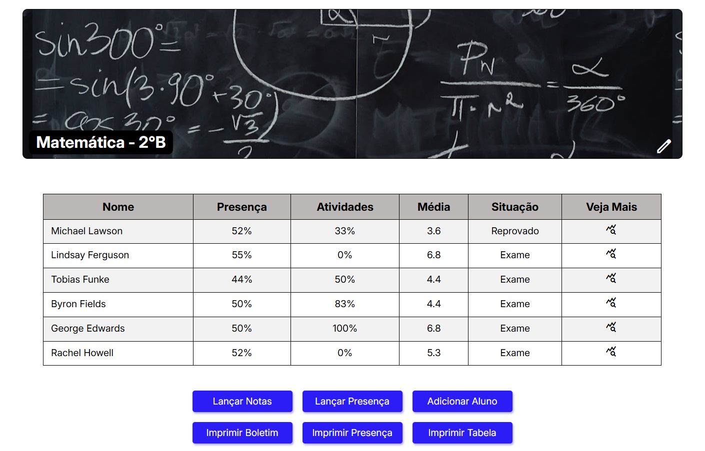

[JAVASCRIPT__BADGE]: https://img.shields.io/badge/Javascript-000?style=for-the-badge&logo=javascript
[HTML__BADGE]: https://img.shields.io/badge/html5-%23E34F26.svg?style=for-the-badge&logo=html5&logoColor=white 
[CSS__BADGE]: https://img.shields.io/badge/css3-%231572B6.svg?style=for-the-badge&logo=css3&logoColor=white
[BOOTSTRAP__BADGE]: https://img.shields.io/badge/bootstrap-%238511FA.svg?style=for-the-badge&logo=bootstrap&logoColor=white 
[MIT__BADGE]: https://img.shields.io/github/license/Naereen/StrapDown.js.svg

<h1 align="center" style="font-weight: bold;">🎓 My Class</h1>

![html][HTML__BADGE]
![css3][CSS__BADGE]
![javascript][JAVASCRIPT__BADGE]
![bootstrap][BOOTSTRAP__BADGE]
![mit][MIT__BADGE]

  <a href="#sobre">Sobre</a> • 
  <a href="#acesso">Acesse Aqui</a> • 
  <a href="#funcionalidades">Funcionalidades</a> • 
  <a href="#licenca">Licença</a> •

 

    

 

<h2 id="sobre">📌 Sobre</h2>
Um sistema escolar onde é possível adicionar alunos, lançar notas, lançar presença, entre outras coisas. Projeto realizado com <strong>HTML</strong>, <strong>CSS</strong>, <strong>Javascript</strong> e  <strong>Bootstrap</strong>, com o objetivo de colocar em prática o que estudei, principalmente em <ins>Javascript</ins>.
 
 

<h2 id="acesso">🚀 Acesse o Projeto</h2>
Veja o projeto você mesmo: https://joaovitordomingos.github.io/My-Class/
 
 

<h2 id="funcionalidades">💻 Funcionalidades</h2>

 
 

<h2 id="licenca">📃 Licença</h2>
Veja a lincença do projeto: <a href="https://github.com/JoaoVitorDomingos/My-Class/tree/main?tab=MIT-1-ov-file">MIT License</a>
 
 
